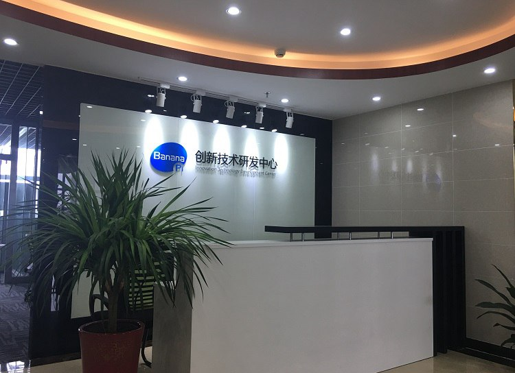
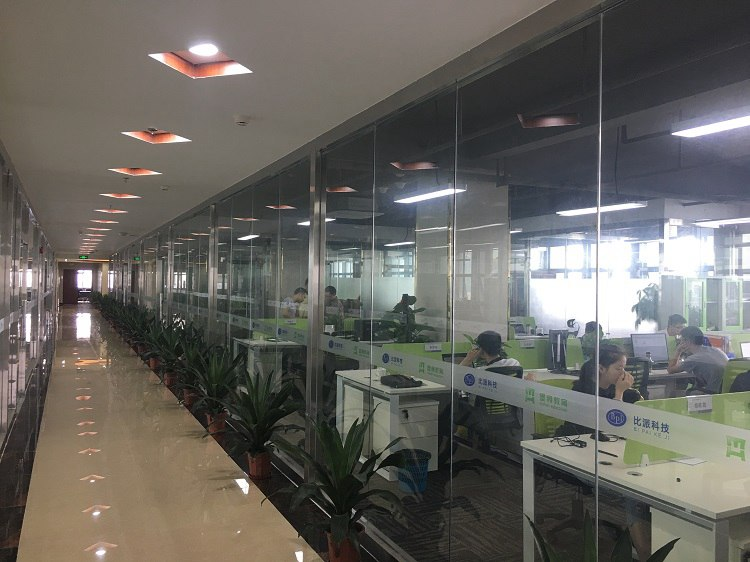

# 比派科技banana-pi开发套件

### 关于我们

- 广东比派科技有限公司，于2015年成立于广东省东莞市松山湖高新技术企业园区，办公地址在松山湖融易大厦七楼。

- 在开源硬件兴起的今天，广东比派科技成功的运作了香蕉派开源硬件项目，在一年多的时间内已经累积销售2,000,000片以上，并形成了BPI系列产品，专注在开源硬件开发与物联网相关的软硬件开发。香蕉派97以上的产品出口海外。形成了BPI品牌商标。成为国内第一的开源硬件品牌。

- 在物联网领域，形成了以BPI为技术核心，提供WiFI，Zigbee，蓝牙，Z-wave全系列技术标准的物联网技术整体解决方案。为客户提供整体解决方案。

### 资源列表 the list of resources

- 开发文档：请查看kit docs文件夹。
- 源代码：LiteOS_BPI_STM32F103R8T6x.rar
