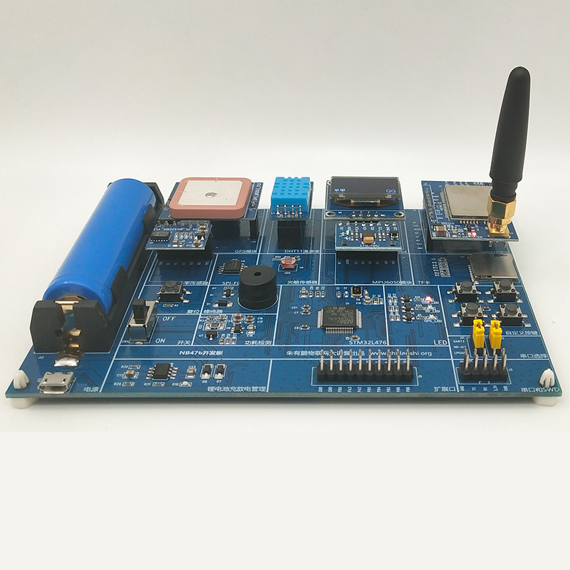
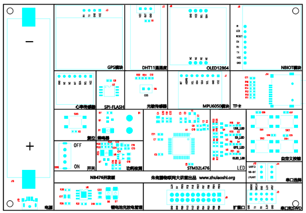

# 鹏力科技NB476开发套件

### 关于我们

- 深圳市鹏力科技有限公司于2015年在深圳市南山区注册，公司以朱有鹏老师及其核心技术团队为依托，推出各种物联网、嵌入式linux、android等技术方向的开发板、在线视频课程、企业级方案，是一家以教育为切入点的创新型电子方案和贸易公司。目前公司有核心团队10余人，均为技术型人才，涵盖嵌入式软件、硬件、生产跟踪等电子产品各关键环节。鹏力科技立志于为客户提供物联网和嵌入式领域的教育学习、方案开发、OEM等一系列综合服务。

  
### 一、简介

- NB476是基于STM32L476的一站式学习型开发板。其适合于物联网开发工程师、相关专业(物联网，嵌入式，单片机，计算机，软件，电子，自动化，通信等)大学生、培训机构、以及对物联网感兴趣想学习相关技术，进入物联网行业的人。

  
- 大量例程与LiteOS移植(持续更新维护中)

  
### 二、NB476详细配置

- 板载器件

| 名称 |	内容 |
| ----  | ---- |
| CPU | STM32L476RGT6 ,Cortex®-M4 ,80MHz|
|SPIFlash| 8M |
|复位按键| 1个|
|调试串口| 1个(支持921600波特率)|
|JTAG/SWD口| 1路SWD|
|LED | 3个|
|外部中断按钮| 4个|
|锋鸣器 | 1个|
|USB OTG| 1个(仅充电)|
|TF卡座| 1个|
|电池供电| 支持1节18650供电，支持板载充放电管理|
|光敏电阻| 1个|

- 扩展模块

| 名称 |	内容 |
| ----  | ---- |
| NBIOT模块 | BC95-B5|
|温湿度传感器| DHT11|
|6轴传感器| MPU6050|
|GPS模块| Air530|
|显示屏| 0.96寸OLED12864|
|心率传感器 | MAX30102|

### 三、资源获取

#### 源码下载&开发指南
    
- [NB476资源(论坛维护)](http://developer.huawei.com/ict/forum/thread-50013.html)

