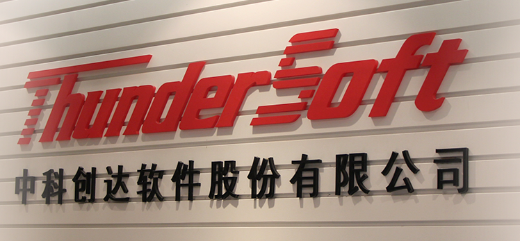
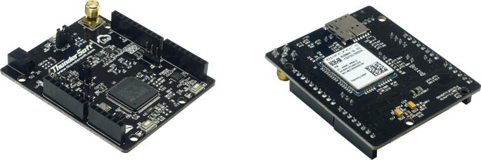

# 中科创达ThunderSoft开发套件

### 关于我们

- 中科创达软件股份有限公司（股票代码:300496）是全球领先的智能终端操作系统及平台技术提供商。自2008年成立以来，公司致力于提供卓越的智能终端操作系统平台技术及解决方案，助力并加速智能手机、智能物联网、智能汽车等领域的产品化与技术创新。 

- 终端设备的智能化已成为必然趋势，而设备端到云端的互联互通正在逐渐渗透到生产生活的各个层面。无论是手机、机器人、无人机、汽车，还是智能电网、智慧物流，都需要更领先、安全可靠的智能操作系统与之匹配。 

- 源于多年在Android、Linux、Windows和HTML5等操作系统技术的研发与创新，中科创达形成了从硬件驱动、操作系统内核、中间件到上层应用全面的技术体系。积累了丰富的研发经验和众多自有知识产权，具备强有力的技术开发和服务能力。核心技术涵盖了通信协议栈、深度学习、图形图像算法、操作系统优化和安全技术等多个方面。 

- 中科创达与智能终端产业链中的芯片、元器件、终端、软件与互联网厂商以及运营商等全球领先企业拥有紧密的合作关系，具有独特的垂直整合优势。作为一家技术驱动型企业，中科创达不但坚持自我创新，也注重扶持创新。一方面与高通、英特尔、微软等分别运营了多个联合实验室，为元器件适配和终端测试提供先进的资源和技术支持；同时与ARM、高通分别成立合资公司——安创空间加速器、重庆创通联达，为智能硬件企业及创新创业者提供产业平台，推动智能硬件技术发展；并与临空投、天使基金、北极光共同成立产业投资基金，整合资源助力创新。 

- 目前，中科创达拥有一支对操作系统技术有深入理解的国际化专业团队。公司总部位于北京，分子公司及研发中心分布于全球17个地区。包括深圳、上海、南京、成都、重庆、武汉、西安、沈阳、大连、台北、香港、美国硅谷、日本东京、韩国首尔、芬兰赫尔辛基。可以为全球客户提供便捷、高效的技术服务和本地支持。 

- 中科创达希望凭借多年积累的领先技术与行业资源，与合作伙伴共同加速并推动智能产业发展。

### ThunderSoft NB-IoT 开发板

#### 一、简介

“低功耗、强链接、新生态、大未来”，共建NB-IoT产业生态，驱动万物互联应用落地，中科创达携手华为推出全球首款NB-IoT开发板，旨在加速窄带物联网的快速普及。NB-loT开发板搭载了Huawei LiteOS开源物联网操作系统和端云互通中间件，其为开发者提供了"一站式" 完整软件平台，向上支持不同的应用业务和算法需求，有效降低开发门槛、加速开发周期。

此开发板借鉴了Arduino的设计，采用了低功耗的STM32L476的MCU，同时板载了三款常用的传感器，分别是：温湿度，压力和六轴。此款开发板的外观尺寸和Arduino Uno相似，因此市面上现有的大多数扣板可以直接拿来使用。

- 完全兼容Arduino, 拥有丰富的配件
- 接口丰富
- UART/I2C/SPI/GPIO
- 低功耗
- MCU运行功耗： 8mA
- NB-IoT模块:
- Idle：6mA
- PSM: 5uA， min
- Tx , max ≈ 240mA

#### 二、规格

基本信息

- LQFP 100管脚封装STM32 MCU
- 两个用户LED灯
- 两个按键开关：一个用户可编程按键及一个复位按键
- DC 5V 供电
- 板载 32.768kHz LSE晶振
- 接口： SPI x1，ADC x 5， PWM x6， UART x1，I2C x1
- 扩展接口：支持Arduino Uno V3
- 板载 NB-IoT 模块及天线座
- 板载 nano SIM 卡槽
- 板载传感器：温湿度 / 压力 / 六轴
- 支持网络： 800MHz, 850MHz(电信，韩国，南美),
- 900MHz（移动，联通，欧洲）

包装内容

- NB-IoT 开发板
- 电源适配器（5V 2A）
- SMA 天线
- 宣传彩页

#### 三、资源获取

源码及指导

- [LiteOS_ThunderSoft_STM32FL476VETx](https://github.com/softbaddog/iot-codelabs/tree/master/1-nbiot-liteos-oceanconnect/miniprojects/LiteOS_ThunderSoft_STM32FL476VETx)
- [ThunderSoft NB-IoT开发板上使用Huawei LiteOS接入OceanConnect IoT平台 ](http://developer.huawei.com/ict/cn/doc/site-liteos-connect-to-oceanconnect/site-liteos-connect-to-oceanconnect.html)

开发指南

- [TurboX NB-IoT 开发板手册_CN/EN](./kit_docs/TurboX_NB-IoT_开发板手册_CN.pdf)
- [NB-IoT 开发板使用手册_CN/EN](./kit_docs/NB-IoT_开发板使用手册_CN.pdf)

模块资料

- [Quectel_BC95_AT_Commands_Manual_V1.3](./kit_docs/Quectel_BC95_AT_Commands_Manual_V1.3.pdf)
- [Quectel_BC95_B650_Version_Application_Notes_and_FAQs_V1.0](./kit_docs/Quectel_BC95_B650_Version_Application_Notes_and_FAQs_V1.0.pdf)
- [Quectel_BC95_NB-IoT_Specification_V1.1](./kit_docs/Quectel_BC95_NB-IoT_Specification_V1.1.pdf)
- [Quectel_BC95_UE_Log_Viewer_User_Guide_V1.0](./kit_docs/Quectel_BC95_UE_Log_Viewer_User_Guide_V1.0.pdf)

