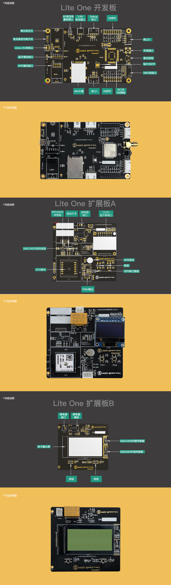

<!-- TOC -->

- [1、概述](#1概述)
- [2、产品预览](#2产品预览)
- [3、资源概述](#3资源概述)
- [4、包装清单](#4包装清单)

<!-- /TOC -->

# 1、概述
LiteOne开发板是一款准捷电子为LiteOS团队定制转为LiteOS_OpenCPU开发的功能型开发板。底板具有特色的高低功耗供电切换，能最大幅度的涵盖NB现有的应用场景。并且在NB网络接通时能同时使用WIFI和蓝牙模块，是一款为物联网而生的开发板。

# 2、产品预览
- 详细说明

# 3、资源概述
## 3.1、主控/NB通信模组
LTE BC28 NB-IoT模组是一款超紧凑、高性能、低功耗的多频段NB-IoT无线通信模块，支持B1/B3/B8/B5/B20/B28*频段。其尺寸仅为17.7mm × 15.8mm × 2.0mm，能最大限度地满足终端设备对小尺寸模块产品的需求，同时有效地帮助客户减小产品尺寸并优化产品成本。

## 3.2、ESP8266（可选）
ESP8266是一款超低功耗的UART-WiFi 透传模块，拥有业内极富竞争力的封装尺寸和超低能耗技术，专为移动设备和物联网应用设计，可将用户的物理设备连接到Wi-Fi 无线网络上，进行互联网或局域网通信，实现联网功能。

## 3.3、蓝牙模块（可选）
主从一体的蓝牙模块，串口转蓝牙，直接透传无需了解任何蓝牙协议。

## 3.4、MAX44009光线传感器（A/B附加板）
MAX44009环境光传感器提供I2C数字输出，可理想用于智能手机、笔记本电脑、工业传感器等便携产品。器件工作电流小于1µA，是业内功耗最低的环境光传感器，具有22位超宽动态范围 。

## 3.5、BME280环境传感器（A/B附加板）
博世出品的高精度传感器，非接触式的温度、湿度、大气压强传感器。超小体积2.5mmx2.5mmx0.93mm。IIC输出、1.71到3.6v的电压支持以及极低的运行功耗，十分适合于数据采集。

## 3.6、MPU6500三轴传感器（A附加板）
市面上最广泛的六轴传感器之一，是MPU6050的升级版，当初设计是专门为了手机/平板电脑/穿戴设备设计的六轴传感器。支持IIC和SPI两种通信方式。

## 3.7、SPIOLED显示屏（A附加板）
SPI通信方式的OLED显示屏，有着低廉的价格和很快的刷新率。

## 3.8、电子墨水屏（B附加板）
合光电子的240x96的电子墨水屏，无背光，断电显示。是一款十分适合低功耗的电子墨水屏，在灯光和日光下都有很好的显示效果。刷新率略低，适用于不需要频繁更新显示内容的应用场景。

## 3.9、继电器（A/B附加板）
继电器250v3A的继电器。常开电路

		
# 4、包装清单
序号|名称|型号|说明
---|---|---|---
1|LiteOne开发板|LiteOS_BC28_OPENCPU|	LiteOS定制的LiteOS_OpenCPU开发板
2|附加板A/B|LiteOS_BC28_OPENCPU_A 、LiteOS_BC28_OPENCPU_B |附加传感器涵盖大部分NB应用的开发板
3|串口工具|CH340|USB转串口的工具，烧写和串口通信
4|4pin串口线|2.54端子+硅胶线20mm|串口通信线
5|5pin串口线|2.54端子+硅胶线20mm|SWD烧写线

