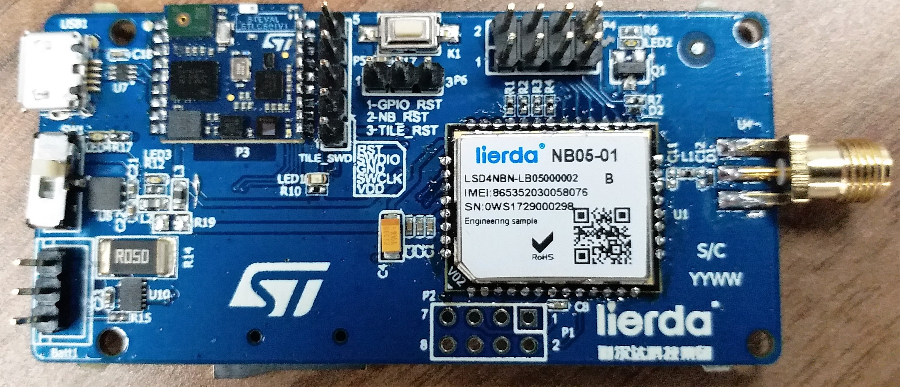
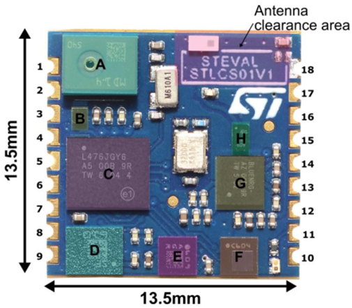
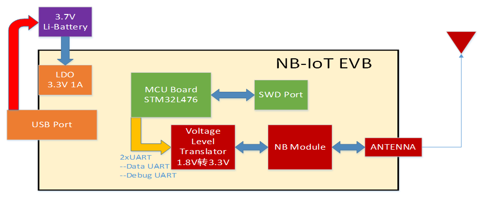
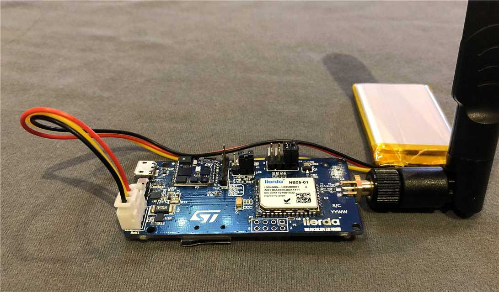

# 利尔达lierda开发套件

### 关于我们

## 基于STM32L476的利尔达NB-IoT开发板

- PN: LSD1EV-STMIOTBD               
- 由利尔达展芯科技有限公司设计

#### 简介

- 这套开发板集成了ST STEVAL-STLCS01核心控制板与Lierda NB05-01模组，
主控为STM32L476JGY6，板载数字麦克风、加速度计、陀螺仪、磁力计、温湿度传感器、气压计等。用户可通过NB模组，连接到利尔达Senthink或华为OceanConnect IoT平台，实现传感器数据的实时上传。 
     
- 另外开发板自带的BLE芯片，可蓝牙连接到APP(ST BlueMS),动态演示传感器数据采集及BlueVoice语音传输。

- LSD1EV-STMIOTBD 开发板以其强大的硬件功能，能让用户便捷和快速地评估ST MCU，MEMS，BLE等器件，搭配利尔达完整的NB-IoT支持生态，助力各种相关的IoT项目开发。

#### 尺寸:71mm x 34mm

#### 功能及应用:

ST STEVAL-STLCS01

- A. MP34DT04 数字麦克风
- B. LD39115J18R_150mA 1.8V输出LDO
- C. STM32L476JGY6: 1M FLASH,128K SRAM,1.71-3.6V,WLCSP72
- D. LSM6DSM_6轴传感器
- E. LSM303AGR_3轴磁力计
- F. LPS22HB_微型气压计
- G. BlueNRG-MS_低功耗蓝牙SOC
- H. BALF-NRG-01D3_带谐波滤波器的50Ω巴伦

#### 软件支持

1. STM32CubeL4底层固件库
2. 嵌入LiteOS               
3. MEMS及蓝牙开发资源支持
4. UDP直传Senthink

#### 资源获取（请参考kit_docs/LSD1EV-STMIOTBD资料包updated文件夹）

源码下载

- ST核心板相关程序源码
- LSD1EV-STMIOTBD_V1.3Lierda源码

原理图

- STEVAL-STLCS01V1_核心板原理图
- LSD1EV-STMIOTBD_V1.1原理图

开发指南

- LSD1EV-STMIOTBD使用说明V1.0

工具

- BlueMS-Release_3.5.1
- BlueMS_APP使用说明

Datasheet

- 板载芯片Datasheet

## Lierda NB-IoT EVB Based On STM32L476

- PN: LSD1EV-STMIOTBD              
- Designed by Gemzing Technology Co.,Ltd

#### Brief：

- This EVB integrates STEVAL-STLCS01 and Lierda NB05-01 module,with 
Controller STM32L476JGY6, Digital Microphone, 3D accelerometer, 3D magnetometer, 3D gyroscope, pressure sensor, humidity and temperature sensor on board. It can connect to Senthink (Lierda) or OceanConnect (HUAWEI) IoT platform through NB-module, performing the real-time data uploading. 

- Besides,user can also use APP “ST BlueMS”(Andriod or IOS) to demonstrate MEMS data acquisition and BlueVoice audio transmission dynamically, connecting to EVB with Bluetooth.

- Benefit from LSD1EV-STMIOTBD powerful hardware function,user can evaluate ST MCU,MEMS and BLE rapidly. With the support from lierda NB-IoT ecosystem, EVB help us accelerate the development of IoT projects.

#### Dimension:71mm x 34mm

#### Function and Application:

ST STEVAL-STLCS01

- A. MP34DT04—digital microphone
- B. LD39115J18R_150mA 1.8V LDO
- C. STM32L476JGY6: 1M FLASH,128K SRAM,1.71-3.6V,WLCSP72
- D. LSM6DSM_low-power 3D accelerometer and 3D gyroscope
- E. E. LSM303AGR_ultra-low power 3D accelerometer and 3D magnetometer
- F. LPS22HB_MEMS nano pressure sensor
- G. BlueNRG-MS_BLE network processor
- H. BALF-NRG-01D3_50Ωbalun

#### Software Support:

1. STM32CubeL4 Firmware LIB
2. Embedded LiteOS 
3. MEMS and BLE
4. Upload data to Senthink with UDP

