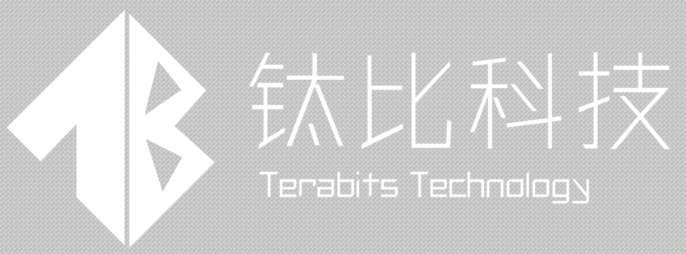
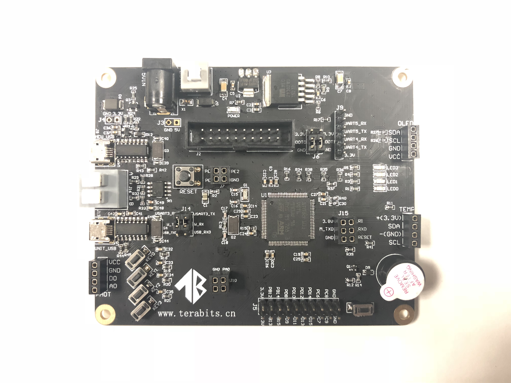
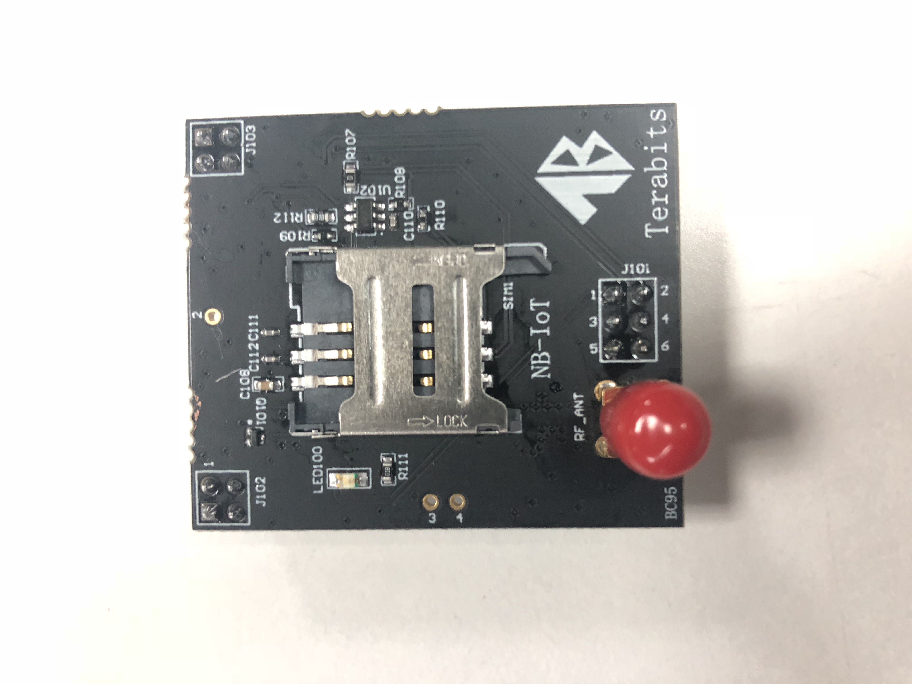
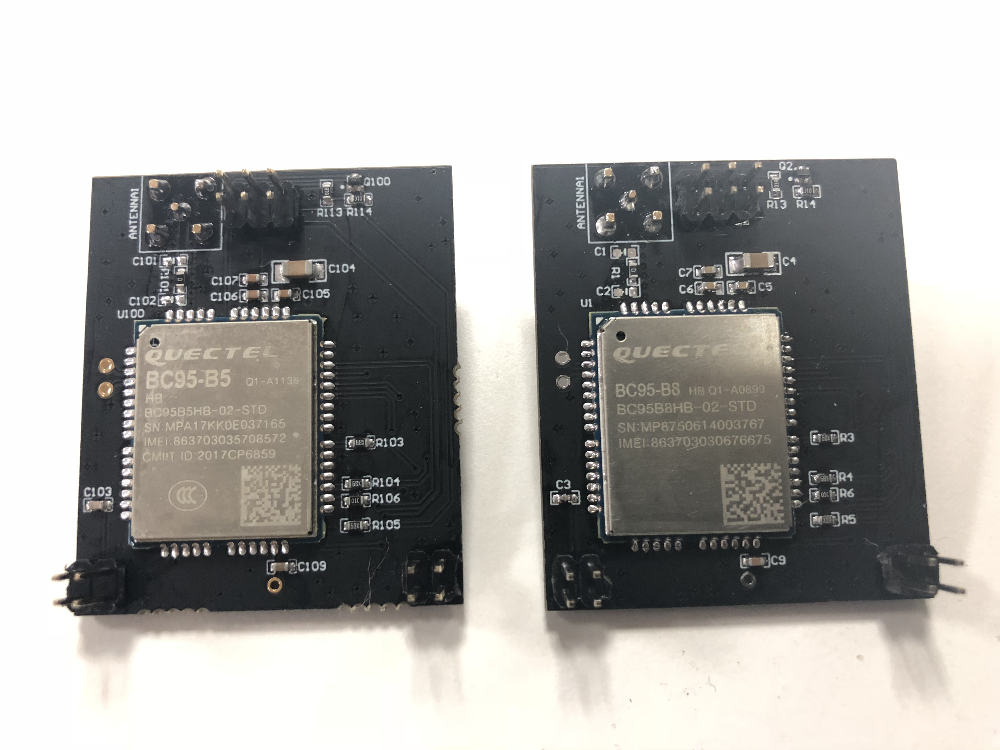

# 钛比科技terabits开发套件

### 关于我们

- 杭州钛比科技有限公司是一家以浙江大学为依托，聚焦物联网技术和工业自动化数据采集产品开发和解决方案提供的高新信息技术企业。公司位于美丽的西子湖畔，杭州市西湖区华星科技大厦内。主要创始人为自动化、信息电子以及计算机专业的博士、硕士，公司员工中有本科以上学历的占90%以上，拥有很强的研发创新能力以及应用推广能力。

### 一、简介

这是一款由钛比科技最新推出的基于STM32F103的高性能物联网开发板，通过配套的JTAG 调试工具可进行下载、仿真调试；通信模块采用移远NB-IoT BC95 模组，通过AT 指令控制。本开发板可用于NB-IoT 物联网终端的学习、评估及开发。

### 二、规格

基本信息

本开发板基于STM32F103系列芯片，该芯片具有高性能、低功耗等特点。其内核为ARM 32位Cortex™-M3 CPU，最高72MHZ的主频率，256KB的闪存，80个高速IO口以及丰富的通讯接口，芯片尺寸仅为16X16mm。

本开发板包括485、用户按键、用户LED、蜂鸣器、温湿度传感器、光敏传感器、OLED显示屏及两种NB-IoT窄带物联网模块和GPRS模块等。除此之外，本开发板还留21个独立IO口、两个UART口可供用户自主选择、设计。

包装内容

- M5310子板
- BC95模块
- 2G模块
- OLED显示屏
- 温湿度传感器
- 光敏传感器
- 主板

### 三、资源获取

源码下载

- [hackathon_demo_onebutton_v1](./kit_docs/hackathon_demo_onebutton_v1.rar)

原理图

- [STM32主板原理图](./kit_docs/STM32主板原理图.pdf)
- [NB-IoT_BC95子板原理图](./kit_docs/NB-IoT_BC95子板原理图.pdf)

开发指南

- [STM32_BC95开发板使用简介_V1.2](./kit_docs/STM32_BC95开发板使用简介_V1.2.pdf)
- [钛比科技 NB-IoT开发工具包说明](./kit_docs/钛比科技NB-IoT开发工具包说明.pdf)

