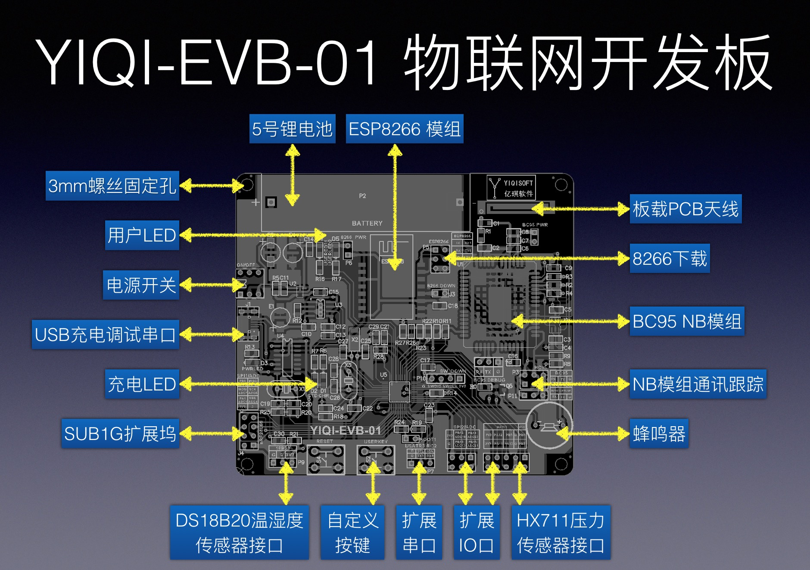
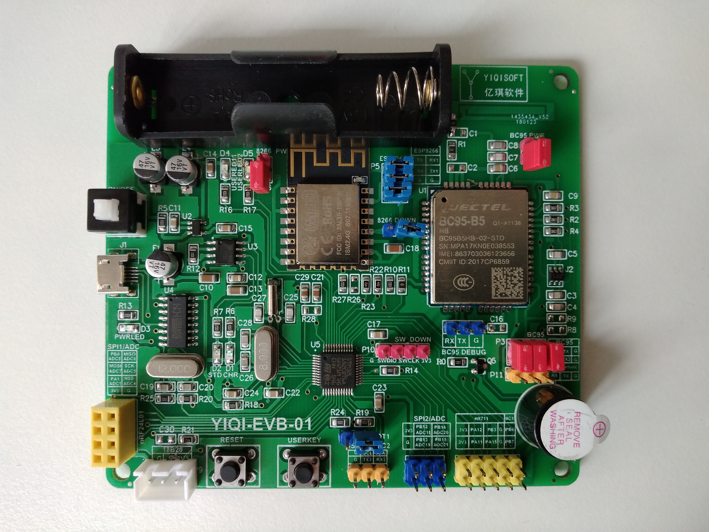

<!-- TOC -->

- [1、概述](#1概述)
- [2、产品预览](#2产品预览)
- [3、资源概述](#3资源概述)
    - [3.1、主控MCU](#31主控mcu)
    - [3.2、BC95模组](#32bc95模组)
    - [3.3、ESP8266](#33esp8266)
    - [3.4、nRF24L01（外置）](#34nrf24l01外置)
    - [3.5、DS18B20（外置）](#35ds18b20外置)
    - [3.6、HX711模块（外置）](#36hx711模块外置)
    - [3.7、充电电路](#37充电电路)
    - [3.8、其他](#38其他)
- [4、硬件参数表](#4硬件参数表)
- [5、包装清单](#5包装清单)

<!-- /TOC -->
# 1、概述
YIQI-EVB-01开发板搭载了超低功耗32位微控制器STM32L152CBT6，采用移远BC95通讯模组的，配备有ESP8266WIFI模组，nRF24L01模块，充电和USB转串口一体化设计，在给电池充电的过程中，实现对数据的监控。
# 2、产品预览
- 详细说明

- 产品实物图

# 3、资源概述
## 3.1、主控MCU
STM32L152是基于Cortex-M3内核的超低功耗微控制器，128KB FLASH, 32KB SRAM, 4KB EEPROM,待机模式功耗仅为0.3 µA。
## 3.2、BC95模组
该产品是全球首款通过GCF 认证的NB-IoT模组产品，模组采用的是华为公司NB-IoT芯片，也是目前NB-IoT全球领先的芯片产品。超低功耗、超高灵敏度，内嵌丰富的网络服务协议栈，便于快速开发。
## 3.3、ESP8266
ESP8266-12F是ESP8266-12的增强版，完善外围电路，四层板板工艺，增强阻抗匹配，信号输出更佳，无论是稳定性还是抗干扰能力，PCB天线经过专业实验室测试，经过ROHS认证，都得到了大幅度的提升！
## 3.4、nRF24L01（外置）
nRF24L01是一款工作在2.4-2.5GHz世界通用ISM频段的单片收发芯片，无线收发器包括：频率发生器 增强型 SchockBurstTM 模式控制器 功率放大器 晶体放大器 调制器 解调器 输出功率频道选择和协议的设置可以通过SPI接口进行设置极低的电流消耗，当工作在发射模式下发射功率为6dBm时电流消耗为9.0mA 接受模式为12.3mA掉电模式和待机模式下电流消耗模式更低
## 3.5、DS18B20（外置）
独特的单线接口方式，DS18B20在与微处理器连接时仅需要一条口线即可实现微处理器与DS18B20的双向通讯。我们更是配备了不锈钢铠装18B20,轻松实现空气和液体温度的测量！
## 3.6、HX711模块（外置）
HX711 采用了海芯科技集成电路专利技术，是一款专为高精度电子秤而设计的24 位A/D 转换器芯片。与同类型其它芯片相比，该芯片集成了包括稳压电源、片内时钟振荡器等其它同类型芯片所需要的外围电路，具有集成度高、响应速度快、抗干扰性强等优点。降低了电子秤的整机成本，提高了整机的性能和可靠性。该芯片与后端MCU 芯片的接口和编程非常简单，所有控制信号由管脚驱动，无需对芯片内部的寄存器编程。输入选择开关可任意选取通道A 或通道B，与其内部的低噪声可编程放大器相连。通道A 的可编程增益为128 或64，对应的满额度差分输入信号幅值分别为±20mV或±40mV。通道B 则为固定的32 增益，用于系统参数检测。芯片内提供的稳压电源可以直接向外部传感器和芯片内的A/D 转换器提供电源，系统板上无需另外的模拟电源。芯片内的时钟振荡器不需要任何外接器件。
## 3.7、充电电路
TP4056 是一款完整的单节锂离子电池采用恒定电流/恒定电压线性充电器。其底部带有散热片的SOP8封装与较少的外部元件数目使得TP4056 成为便携式应用的理想选择。
## 3.8、其他
为了便于开发者进行扩展试验，芯片的端口由排针外引。同时板载了USB转串口电路，便于用户进行开发调试。
# 4、硬件参数表
YIQI-EVB-01 开发板
类别 | 参数 | 特殊说明
---|---|---
尺寸|93mm*83mm|
主控MCU|STM32L152CBT6|超低功耗MCU
充电电路|TP4056|电流最大支持1A
NB-IOT模组|BC95|电信B5，移动/联通B8，海外B20
WiFi|ESP8266|4MB flash	
SUB1G|nRF24L01|8P 插针式
温度传感器|DS18B20|3P XH2.54	
称重传感器|HX711|
用户指示灯|一红一绿|
用户按键|轻触开关6*6*5	
蜂鸣器|有源一体蜂鸣器	
扩展端口|支持IIC*2, SPI*2, USART*1	
复位按键|轻触开关
自锁总开关|带锁按键开关	
USB转串口电路|CH340	
		
# 5、包装清单
序号|名称|型号|说明
---|---|---|---
1|物联网开发板|YIQI-EVB系列|	高度集成多功能NB-IoT物联网开发评估板，板载内置BC95 NB-IoT模组，ESP8266 WiFi模组，PCB板载天线 
2|SUB1G 模组|NF-01-N|外置插针式SUB1G 2.4G模组
3|传感器|DS18B20|DS18B20防水型单总线温度传感器，含3P XH2.54插头
4|传感器|HX711套件|双线压力称重传感器套件，含双头4P XH2.54排线
5|单片机下载器|ST-LINK V2|支持STM8和STM32程序下载仿真器
6|串口转换器|CH340G|USB转TTL串口器，含4P 母母排线
7|线材|配套线材|20CM 杜邦线20根（母母10根，公母5根，公公5根），15CM 热缩管2根
8|USB线|Micro USB|50CM Micro USB串口线1根
9|物联网卡|联通/电信|可选运营商NB-IoT物联网卡，含1年使用费
10|锂电池|14500锂电池|5号，850mA， 3.7-4.2V锂电池

